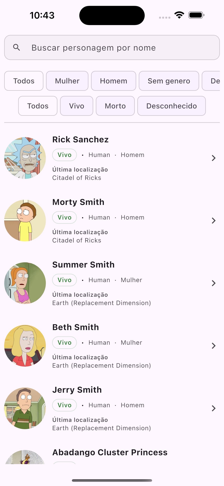
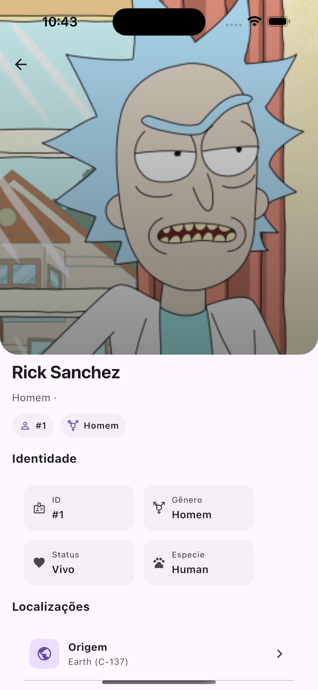

# Way Data App — Monorepo Flutter

<p align="center">
  
  
  

</p>

Aplicação Flutter em **monorepo** composta por `morphling`, `core` e `instance`.
Foco em arquitetura limpa, BLoC via Streams e DI com `getIt`.

## Nota

Para facilitar o desenvolvimento e a colaboração, o projeto está organizado em um **monorepo** com todos os módulos necessários. A proposta é **separar responsabilidades** e permitir **evolução independente** das partes, mantendo um fluxo de trabalho previsível e escalável.

---

## Contemplações

* **Clean Architecture escalonável**
* **BLoC via Streams** (estados `loading / stable / error / empty`)
* **Injeção de dependências** com `getIt`
* **Boas práticas de Git** (commits atômicos & convencionais)

---

## Arquitetura Clean Architecture

A arquitetura favorece **reuso**, **testabilidade** e **baixo acoplamento**.

* **morphling** — Base do monorepo: contratos/abstrações, helpers, padronizações (logs, guards, tipos base).
* **core** — Infraestrutura e domínio compartilhado: HTTP, gates (contratos), paginação, extensions, env, **repos/datasources** e **BLoCs das features**.
* **instance** — App executável: UI, rotas, tema e **composition root/DI** (onde tudo é montado e injetado).

/
├─ morphling/ # base (contratos, abstrações, helpers, padronizações)
├─ core/ # domínio + infra compartilhada (HTTP, gates, pagination, env, BLoCs)
└─ instance/ # app (UI, rotas, theme, composition root/DI)
Sempre exibir os detalhes

---

## Configurações necessárias para execução do projeto

> iOS/CocoaPods (Apple Silicon): se necessário, rode `arch --x86_64 pod install --repo-update` dentro do diretório `ios/` do app.

---

## Antes de executar o projeto

* Versão utilizada no projeto Flutter: 3.35.3 - Dart 3.9.2
* Verifique `flutter --version` e `flutter doctor`.
* Inicie um device/emulador(iOS | Android).
* Garanta que executou `flutter pub get` em **cada módulo** na **ordem correta**.

---

## Como rodar (passo a passo)

* **Clone o repositório**
  ```bash
  git clone https://github.com/v1niciusalmeid4/way-data-app.git
  cd way-data-app
Instale dependências na ordem correta
(A ordem importa porque os módulos se referenciam entre si.)
Sempre exibir os detalhes

* cd morphling && flutter clean && flutter pub get && cd ..
* cd core  && flutter clean && flutter pub get && cd ..
* cd instance  && flutter clean && flutter pub get
  
* flutter run -t lib/main.dart -> (dentro do instance)

# Decisões técnicas
* BLoC via Streams
Por quê? Controle fino de ciclo de vida, baixo overhead e previsibilidade.
Como? BLoCs expõem streams de estado (loading / stable / error) e recebem events/intents da UI.
* Benefícios: Testabilidade e separação orquestração (BLoC) × apresentação (Widgets).
* Injeção de Dependências com getIt
Por quê? Desacoplamento e troca simples de implementações (mocks vs. reais).
Como? Registrations por módulo/feature (ex.: AppInjector, FeatureInjector) com lazySingleton.
* Benefícios: Inicialização controlada e pontos únicos de configuração.
* Modularização morphling / core / instance
Por quê? Reuso, escalabilidade e builds previsíveis.
Como?
core mantém contratos/infra compartilhados e agnósticos à UI
instance orquestra DI e UI (composition root)
morphling consolida as padronizações do monorepo
* Benefícios: Menor acoplamento e organização por responsabilidade.
* Solução de problemas
Imports vermelhos / dependências não resolvidas
→ Rode flutter clean && flutter pub get em cada módulo e respeite a ordem.
Dispositivo não aparece
→ flutter devices e inicie um emulador/simulador.
